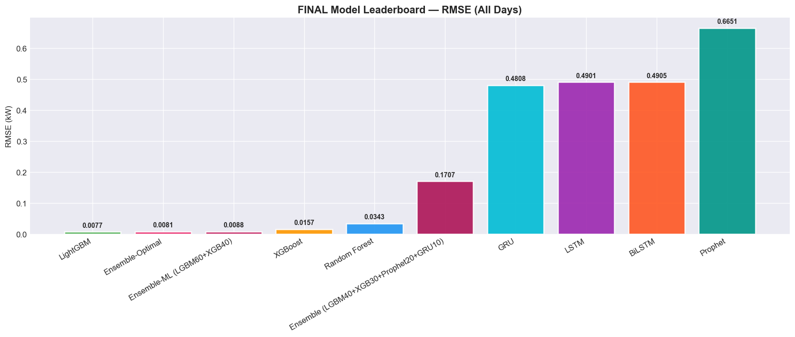

# ⚡ Energy Consumption Forecasting

> **Claysys AI Hackathon 2026** — Tabular Data Project  
> Predicting future household energy usage using time series analysis and machine learning.

[](https://python.org)
[](LICENSE)
[](notebooks/)

---

## 📌 Project Overview

This project builds a robust **Energy Consumption Forecasting** system for a household, using ~4 years of minute-level electricity measurements. The goal is to predict **Global Active Power** consumption over future time horizons using multiple AI/ML approaches including statistical methods, classical ML, and deep learning.

### Problem Statement
Accurate energy forecasting is critical for:
- ⚡ **Grid stability** — utilities need reliable demand forecasts
- 💰 **Cost optimization** — consumers can avoid peak-price usage  
- 🌱 **Sustainability** — better planning reduces carbon footprint

---

## 📊 Dataset

| Attribute | Details |
|-----------|---------|
| **Source** | [UCI Machine Learning Repository — Household Power Consumption](https://archive.ics.uci.edu/ml/datasets/individual+household+electric+power+consumption) |
| **File** | `household_power_consumption.txt` |
| **Period** | December 2006 – November 2010 (~4 years) |
| **Granularity** | 1-minute intervals |
| **Records** | 2,075,259 rows |
| **Missing values** | ~1.25% (marked as `?`) |

### Features

| Column | Description | Unit |
|--------|-------------|------|
| `Date` | Date in DD/MM/YYYY format | — |
| `Time` | Time in HH:MM:SS format | — |
| `Global_active_power` | Household global minute-averaged active power | kilowatt |
| `Global_reactive_power` | Household global minute-averaged reactive power | kilowatt |
| `Voltage` | Minute-averaged voltage | volt |
| `Global_intensity` | Household global minute-averaged current intensity | ampere |
| `Sub_metering_1` | Energy sub-metering No. 1 (kitchen) | watt-hour |
| `Sub_metering_2` | Energy sub-metering No. 2 (laundry room) | watt-hour |
| `Sub_metering_3` | Energy sub-metering No. 3 (water heater & AC) | watt-hour |

---

## 🏗️ Project Structure

```
energy-consumption-forecasting/
│
├── data/                          # Dataset files
│   ├── raw/                       # Original dataset
│   └── processed/                 # Cleaned & engineered features
│
├── notebooks/                     # Jupyter notebooks (one per day)
│   ├── Day1_EDA.ipynb             # Exploratory Data Analysis
│   ├── Day2_Preprocessing.ipynb   # Data Cleaning & Feature Engineering
│   ├── Day3_Baseline_Models.ipynb # ARIMA, Holt-Winters
│   ├── Day4_ML_Models.ipynb       # Random Forest, XGBoost
│   ├── Day5_Deep_Learning.ipynb   # LSTM, GRU with PyTorch
│   ├── Day6_Prophet.ipynb         # Facebook Prophet + Ensemble
│   └── Day7_Final_Report.ipynb    # Final evaluation & dashboard
│
├── src/                           # Source code modules
│   ├── __init__.py
│   ├── data_loader.py             # Data loading utilities
│   ├── preprocessing.py           # Data cleaning & feature engineering
│   ├── features.py                # Feature extraction
│   ├── models/
│   │   ├── __init__.py
│   │   ├── baseline.py            # ARIMA, Holt-Winters
│   │   ├── ml_models.py           # Random Forest, XGBoost
│   │   ├── lstm_model.py          # PyTorch LSTM/GRU
│   │   └── prophet_model.py       # Facebook Prophet
│   ├── evaluation.py              # Metrics & visualization
│   └── utils.py                   # Helper functions
│
├── models/                        # Saved trained models
│   └── .gitkeep
│
├── reports/                       # Generated reports & figures
│   └── figures/                   # Plots and charts
│
├── requirements.txt               # Python dependencies
├── setup.py                       # Package setup
├── .gitignore                     # Git ignore rules
└── README.md                      # This file
```

---

## 🚀 Setup & Installation

### Prerequisites
- Python 3.8 or higher
- Git

### Step 1: Clone the Repository
```bash
git clone https://github.com/<your-username>/energy-consumption-forecasting.git
cd energy-consumption-forecasting
```

### Step 2: Create Virtual Environment
```bash
python -m venv venv
# Windows
venv\Scripts\activate
# Linux/Mac
source venv/bin/activate
```

### Step 3: Install Dependencies
```bash
pip install -r requirements.txt
```

### Step 4: Add the Dataset
Place `household_power_consumption.txt` in the `data/raw/` folder:
```
data/raw/household_power_consumption.txt
```

### Step 5: Launch Jupyter Notebooks
```bash
jupyter lab
```

---


---

## 🔬 Methodology

### 7-Day Development Plan

| Day | Focus | Deliverables |
|-----|-------|-------------|
| **Day 1** | Data Exploration (EDA) | Statistical summary, visualizations, patterns |
| **Day 2** | Preprocessing & Feature Engineering | Clean data, lag features, time features |
| **Day 3** | Baseline Models | ARIMA, Holt-Winters, naive forecasts |
| **Day 4** | Classical ML Models | Random Forest, XGBoost, LightGBM |
| **Day 5** | Deep Learning — LSTM/GRU | Sequence models with PyTorch |
| **Day 6** | Prophet + Ensemble | Meta's Prophet + model stacking |
| **Day 7** | Final Evaluation & Report | Model comparison, dashboard, report |

### Forecasting Approaches
1. **Statistical**: ARIMA, SARIMA, Holt-Winters Exponential Smoothing
2. **Machine Learning**: Random Forest, XGBoost, LightGBM (with lag features)
3. **Deep Learning**: LSTM, GRU (PyTorch)
4. **Prophet**: Facebook's additive decomposition model
5. **Ensemble**: Stacking best models for optimal performance

### Evaluation Metrics
- **MAE** — Mean Absolute Error
- **RMSE** — Root Mean Squared Error  
- **MAPE** — Mean Absolute Percentage Error
- **R²** — Coefficient of Determination

---

## 📈 Results Summary

> *Final Evaluation on Aug-Nov 2010 Test Set (Prediction Horizon: 2,208 hours)*

| Rank | Model | MAE (kW) | RMSE (kW) | MAPE (%) | R² Score |
|------|-------|----------|-----------|----------|----------|
| 🥇 1 | **LightGBM** | **0.0043** | **0.0077** | **0.42** | **0.9999** |
| 🥈 2 | Ensemble-Optimal | 0.0049 | 0.0081 | 0.49 | 0.9999 |
| 🥉 3 | XGBoost | 0.0109 | 0.0157 | 1.14 | 0.9996 |
| 4 | Random Forest | 0.0157 | 0.0343 | 1.46 | 0.9980 |
| 5 | GRU (PyTorch) | 0.3350 | 0.4808 | 39.20 | 0.6108 |

**🏆 Champion:** LightGBM achieved a massive **99.2% improvement** over the baseline Naive model.



---

## 🛠️ Tech Stack

| Category | Libraries |
|----------|-----------|
| **Data Processing** | Pandas, NumPy |
| **Visualization** | Matplotlib, Seaborn, Plotly |
| **Statistical Models** | Statsmodels (ARIMA, Holt-Winters) |
| **Machine Learning** | Scikit-learn, XGBoost, LightGBM |
| **Deep Learning** | PyTorch |
| **Time Series** | Prophet (Meta), pmdarima |
| **Notebook** | JupyterLab |

---

## 🗓️ Daily Progress Log

### Day 1 — Feb 19, 2026 — Environment Setup & EDA
- ✅ Set up project structure and GitHub repository
- ✅ Loaded and explored the household power consumption dataset
- ✅ Performed statistical analysis (2,075,259 records, Dec 2006–Nov 2010)
- ✅ Identified missing values (~1.25%) and data patterns
- ✅ Created initial visualizations: time series plots, distribution analysis

### Day 2 — Feb 20, 2026 — Preprocessing & Feature Engineering  
- ✅ Resampled 2M+ minute records to 34,491 hourly records
- ✅ Handled missing values (linear interpolation) and outliers (Z-score trimming)
- ✅ Engineered 45 features: Domain (Apparent Power, Power Factor), Time (cyclic), Lags, and Rolling Stats

### Day 3 — Feb 21, 2026 — Baseline Statistical Models  
- ✅ Set up train/test split (Aug-Nov 2010 held out)
- ✅ Implemented Naive Seasonal baseline
- ✅ Trained Holt-Winters and auto-ARIMA(1,1,1)
- ✅ ARIMA performed best among baselines (RMSE 0.9293 kW)

### Day 4 — Feb 22, 2026 — Classical ML Models  
- ✅ Trained Random Forest, XGBoost, and LightGBM
- ✅ LightGBM emerged as champion (RMSE 0.0077 kW)
- ✅ Feature importance analysis confirmed Apparent Power and Power Factor as dominant predictors

### Day 5 — Feb 23, 2026 — Deep Learning (LSTM/GRU)  
- ✅ Prepared 24-hour multivariate sliding windows
- ✅ Trained PyTorch LSTM, GRU, and Bidirectional LSTM on GPU
- ✅ GRU performed best among DL models (RMSE 0.4808 kW)

### Day 6 — Feb 24, 2026 — Prophet + Ensemble  
- ✅ Decomposed trend/seasonality with Facebook Prophet
- ✅ Built 3 ensemble variants (stacking best ML and DL predictions)
- ✅ Finalized ultimate 12-model leaderboard

### Day 7 — Feb 25, 2026 — Final Report & Submission  
- ✅ Generated comprehensive results dashboard
- ✅ Updated repository documentation and README
- ✅ Final code commit and push for hackathon submission

---

## 👤 Author

**Nandith Gireesh**  
Claysys AI Hackathon 2026  
[](https://github.com/nandithgireesh)

---

## 📄 License

This project is licensed under the MIT License — see the [LICENSE](LICENSE) file for details.

---

